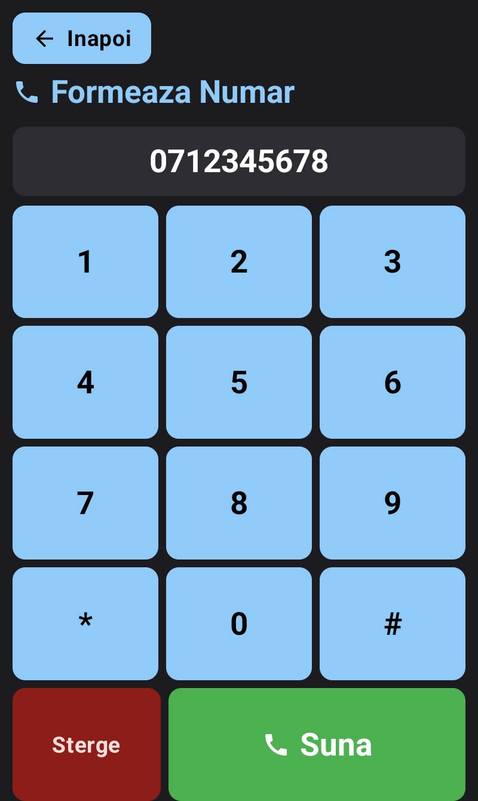
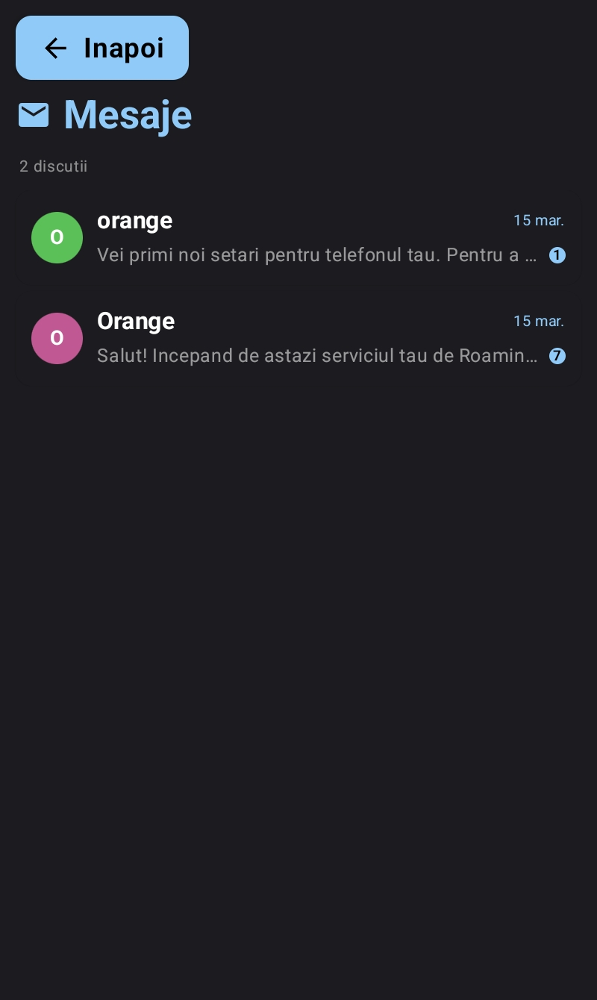
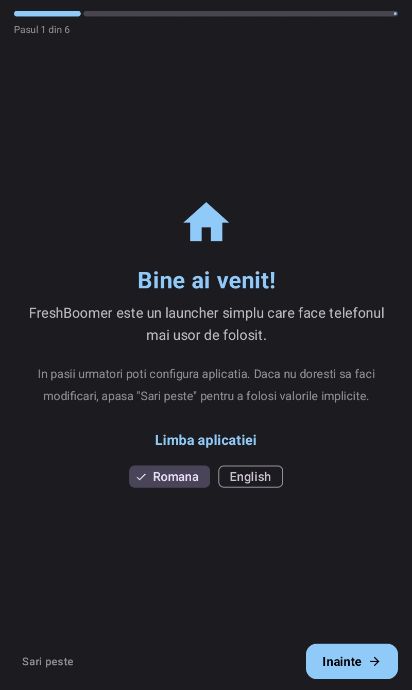
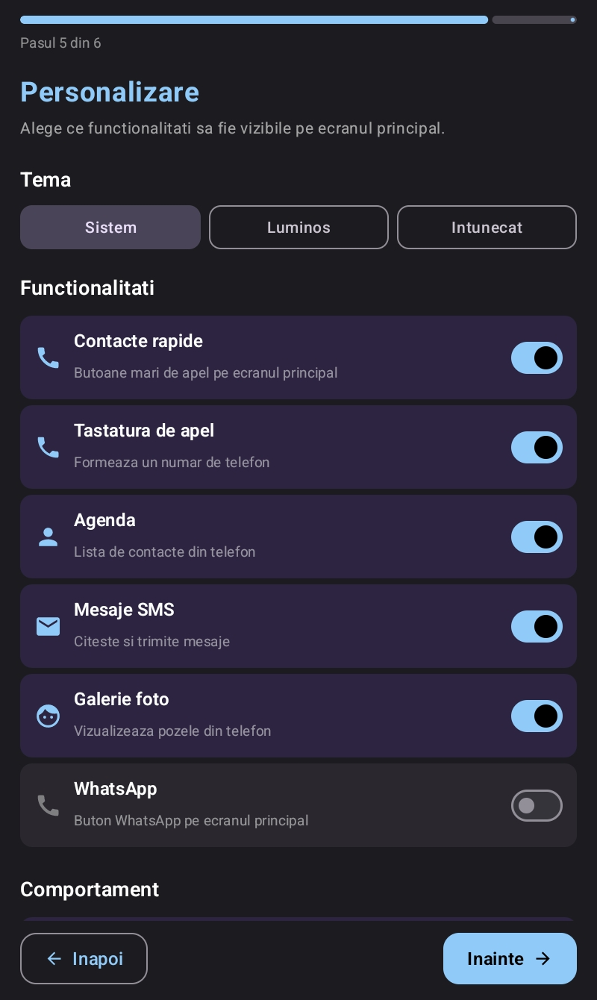
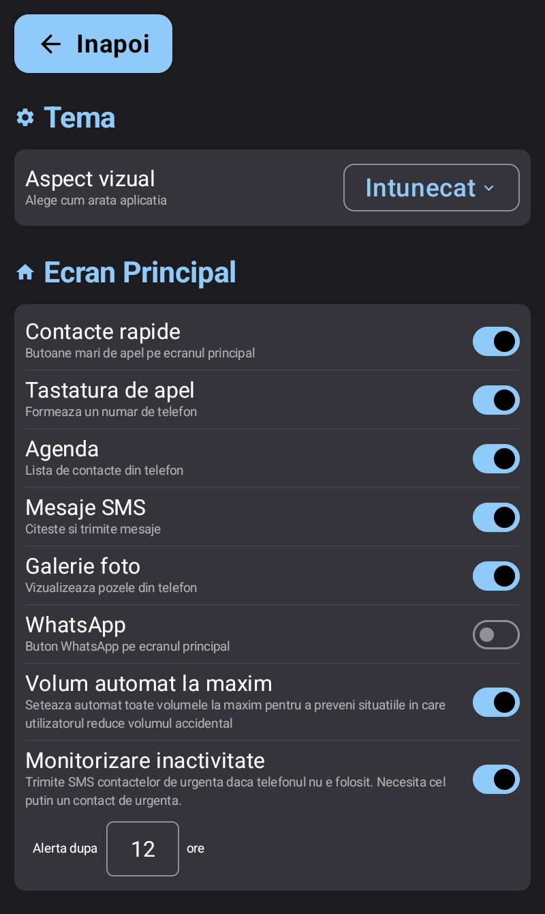
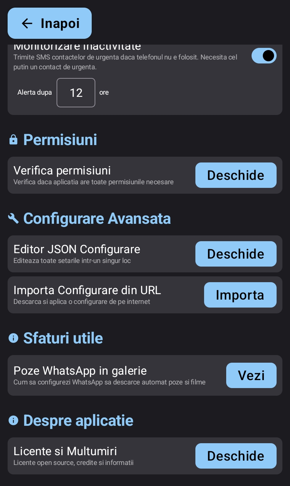
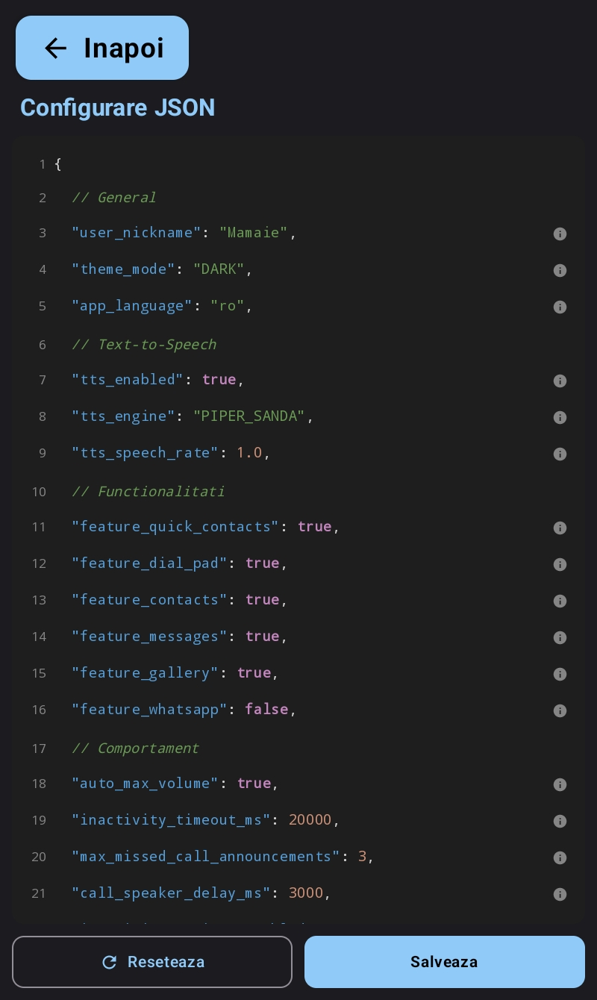

<p align="center">
  
</p>

# FreshBoomer

A simplified Android home launcher designed for elderly users. Replaces the default launcher, phone, and SMS apps with a large-button, accessible interface in Romanian and English featuring text-to-speech accessibility.

**Package:** `ro.softwarechef.freshboomer`

## Download

<p align="center">
  <a href="https://play.google.com/store/apps/details?id=ro.softwarechef.freshboomer">
    
  </a>
</p>

Or grab the latest APK from the [Releases](https://github.com/cristianonescu/FreshBoomer-Launcher/releases) page.

## Screenshots

<p align="center">
  
  
  
  
</p>
<p align="center">
  
  
  
  
</p>

## Features

### Home Screen
- Analog + digital clock with localized date
- Battery status indicators (low, charging, full)
- Quick-dial contact grid with custom photos and color-coded avatars
- Missed call banner with caller info and quick call-back
- One-tap navigation to all app features

### Phone
- Large-button dial pad
- Automatic speaker routing and max volume on calls
- Full-screen incoming/in-call UI with large buttons
- Call duration timer and contact name resolution

### Contacts
- Alphabetically grouped list with search
- Add, edit, delete via system interface
- Call confirmation dialog before dialing

### SMS Messaging
- Conversation list with unread badges and message previews
- Message thread with sent/received bubbles
- Compose and send SMS (registered as default SMS app)

### Photo Gallery
- Full-screen viewer with swipe navigation and slide counter

### WhatsApp Integration
- Quick-launch button on home screen
- Incoming call detection via notification listener
- Dedicated call screen with caller name

### Text-to-Speech (Romanian)
- Offline TTS via Piper (ONNX VITS models, Sanda and Lili voices) with device default fallback
- Voice announcements for navigation, calls, missed calls, battery status
- Configurable speech rate (0.5x - 2.0x)

### Medication Reminders
- Configurable medication reminders with name, time, and days of week
- Full-screen alert with TTS announcement (e.g., "Mamaie, ia pastilele de tensiune")
- Snooze option (configurable duration, max 3 snoozes per reminder)
- Survives device reboots via AlarmManager + boot receiver
- Configurable in-app and via remote config

### Voice SMS Messages (Remote TTS)
- Caretaker can send an SMS starting with "CITESTE:" or "READ:" to have it read aloud
- Full-screen overlay displays the message with replay and dismiss buttons
- Auto-dismiss after 30 seconds
- Configurable trusted-sender whitelist (emergency contacts only by default)
- Both prefixes are always recognized regardless of app language setting

### Safety & Monitoring
- Inactivity timeout (auto-return to home screen, default 20s)
- Inactivity monitor with SMS alerts to emergency contacts after configurable hours of no interaction
- Missed call TTS announcements (up to 3 per unique number)

### Configuration
- First-run setup wizard
- In-app settings with per-feature toggles
- Advanced JSON config editor
- Remote config import from URL (HTTP & HTTPS) with automatic re-sync on every home screen resume
- Smart config versioning: `config_version` (integer) and `config_updated_at` (ISO 8601 timestamp) fields allow the app to skip re-applying unchanged remote configs and detect when new settings should override local edits
- Quick contact photos via base64-encoded images in the JSON config, automatically decoded and stored locally on import
- Theme selection (System / Light / Dark)
- Language selection (Romanian / English) with runtime locale switching

### Accessibility
- Full-screen immersive mode
- Large fonts (24-40sp), high-contrast colors, rounded buttons
- Portrait-only, single-task launch mode
- Multi-language support (Romanian and English), selectable during onboarding and in settings

## Requirements

- Android 11+ (API 30)
- JDK 11

## Build

```bash
# Debug APK
./gradlew :app:assembleDebug

# Release APK
./gradlew :app:assembleRelease

# Unit tests
./gradlew :app:test
```

## Project Structure

```
app/src/main/java/ro/softwarechef/freshboomer/
├── MainActivity.kt              # Home screen
├── PhoneActivity.kt             # Dial pad
├── ContactsActivity.kt          # Contact list
├── SmsActivity.kt               # SMS conversations
├── GalleryActivity.kt           # Photo gallery
├── InCallActivity.kt            # Active call UI
├── IncomingCallActivity.kt      # Incoming call UI
├── WhatsAppCallActivity.kt      # WhatsApp call UI
├── call/                        # Call manager & InCallService
├── data/                        # AppConfig, ConfigData, LocaleHelper, preferences, repositories
├── models/                      # Contact, QuickContact
├── onboarding/                  # Setup wizard, permission onboarding
├── receivers/                   # SMS, MMS, phone call receivers
├── services/                    # InactivityMonitorWorker, HeadlessSmsSendService, MmsService
└── ui/
    ├── composables/             # ImmersiveActivity, settings screen, shared components
    └── theme/                   # Material3 theme, colors, typography
```

## Architecture

Single-module, activity-based architecture with Jetpack Compose UI. No DI framework, no navigation library -- activities communicate via Intents.

- **State management:** Compose `mutableStateOf` / `remember` + `StateFlow` for config
- **Configuration:** Centralized `AppConfig` singleton with JSON file persistence, SharedPreferences sync, and remote URL import
- **Localization:** Runtime locale switching via `LocaleHelper` — language is read from `config.json` on disk at `attachBaseContext()` time, before `AppConfig` initializes. Full English translation in `values-en/strings.xml`
- **TTS:** Piper ONNX engine (offline Romanian) with device default fallback
- **Persistence:** JSON files (`config.json`, `quick_contacts.json`) + SharedPreferences

## Tech Stack

Kotlin, Jetpack Compose (Material3), AndroidX Activity Compose, Coil (image loading), Sherpa-ONNX / Piper (TTS), WorkManager (inactivity monitor).

## Documentation

Interactive HTML documentation is available in the `docs/` directory:

| File | Description |
|------|-------------|
| [`docs/config-feature.html`](docs/config-feature.html) | Configuration system deep-dive -- covers ConfigData model, AppConfig singleton, storage layers, editing UI, remote import & auto-sync, data flow diagrams, and full file reference |
| [`docs/config-editor.html`](docs/config-editor.html) | Interactive configuration editor -- a web-based tool to build, edit, and export FreshBoomer config JSON files. Use this to prepare config files for remote deployment |

Open these files directly in a browser for a styled, navigable reference.

## Remote Configuration

FreshBoomer supports remote configuration, allowing a caretaker to manage the device settings without physical access.

1. **Host a JSON config file** on any web server, cloud storage, or even a GitHub Gist (raw URL). The file follows the schema documented in [`docs/config-feature.html`](docs/config-feature.html). Use the [`docs/config-editor.html`](docs/config-editor.html) tool to build the JSON visually -- including adding contact photos with automatic resizing.
2. **Import the URL** on the device via Settings > Advanced Config > "Importa configurare din URL".
3. **Automatic sync** -- once a URL is set, the app automatically re-fetches the config every time the user returns to the home screen. The URL is stored independently in SharedPreferences and cannot be overwritten by the remote JSON itself.
4. **Smart change detection** -- the config includes a `config_version` counter and `config_updated_at` timestamp. On auto-sync, the app only applies the remote config if its version is newer than the last applied version, avoiding unnecessary overwrites. Manual imports from Settings always apply regardless of version.

Only the fields present in the remote JSON are applied; missing fields keep their current values. Both HTTP and HTTPS URLs are supported.

### Contact Photos via Remote Config

Quick contacts can include base64-encoded photos in the JSON config (`photo_base64` and `photo_mime` fields). The HTML config editor resizes images to max 200x200px JPEG before encoding. On import, the app decodes the base64 data into image files stored in internal storage, so the photos display on the launcher. Photos can also be set locally via the in-app photo picker -- both methods coexist.

## System Roles

The app registers as the device's:
- **Home launcher** (HOME category)
- **Default phone** (DIAL handler)
- **Default SMS app** (SMS_DELIVER receiver)

## Open Source Licenses

This project uses the following open source libraries:

| Library | License |
|---------|---------|
| [Jetpack Compose](https://developer.android.com/jetpack/compose) | Apache License 2.0 |
| [AndroidX Core / AppCompat / Lifecycle](https://developer.android.com/jetpack/androidx) | Apache License 2.0 |
| [Material Design 3](https://m3.material.io) | Apache License 2.0 |
| [Coil](https://coil-kt.github.io/coil/) | Apache License 2.0 |
| [Kotlin Coroutines](https://github.com/Kotlin/kotlinx.coroutines) | Apache License 2.0 |
| [Sherpa ONNX](https://github.com/k2-fsa/sherpa-onnx) | Apache License 2.0 |
| [Piper TTS](https://github.com/rhasspy/piper) | MIT License |

## Credits

- **Piper TTS Romanian** -- The Romanian voice models (Lili and Sanda) used in this app are created by [eduardem](https://huggingface.co/eduardem/piper-tts-romanian). Thank you for the contribution to Romanian speech synthesis!
- **Developer** -- Cristian Onescu

## License

All rights reserved.
